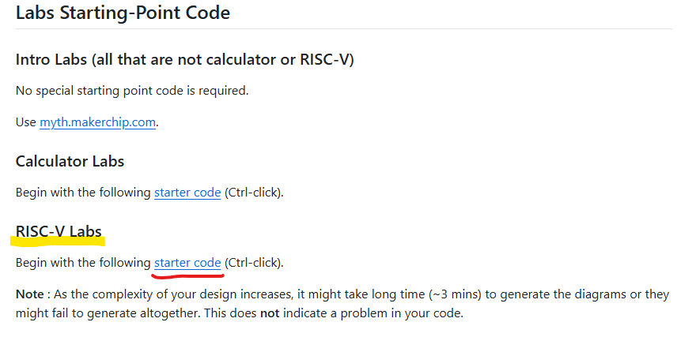

# **RV32 Single-Cycle RISC-V CPU Core**

A single-cycle RISC-V CPU core is a fundamental implementation of the RISC-V instruction set architecture (ISA) designed to execute each instruction in a single clock cycle. This architecture prioritizes simplicity, making it an excellent starting point for understanding processor design.

In a single-cycle processor, all components—including instruction fetch, decode, execute, memory access, and write-back—operate in parallel within one cycle. While this simplifies control logic, it also results in increased critical path delay, limiting clock speed.

This design serves as a foundation for more advanced architectures like pipelined and superscalar processors. 

## Microarchitecture of RISCV CPU(RV32) :

The microarchitecture of a RISC-V CPU defines the internal structure and data flow required to execute instructions efficiently. It consists of several key components that work together to fetch, decode, execute, and store results. The microarchitecture follows the principles of the RISC-V ISA.


### **Key Components of RISC-V CPU Microarchitecture**  


#### **Program Counter (PC) & Branch Unit**  
   - Maintains the address of the **current instruction**.  
   - Updates based on sequential execution or **branch/jump instructions**.  
   - Works with the ALU to determine branch conditions (BEQ, BNE, JAL).
     
#### **Instruction Fetch Unit (IFU)**  
   - Fetches instructions from memory based on the **Program Counter (PC)**.  
   - Uses an **Instruction Memory** to store and retrieve instructions.  
   - Increments the PC to point to the next instruction.  

#### **Instruction Decode Unit (IDU)**  
   - Decodes the fetched instruction into its operation and operands.  
   - Extracts register addresses, immediate values, and control signals.  
   - Generates necessary control signals for the **ALU, registers, and memory**.  

#### **Register File**  
   - Consists of **32 registers (x0 to x31)**, where x0 is hardwired to zero.  
   - Provides source operands to the ALU and stores results back after execution.  

#### **Arithmetic Logic Unit (ALU)**  
   - Performs arithmetic (ADD, SUB, MUL) and logical (AND, OR, XOR) operations.  
   - Evaluates branch conditions for **conditional jumps**.  
   - Supports shift operations (SLL, SRL, SRA).


## **RISCV Assembly code :**
On our designed RISCV CPU core in TL-Verilog, we are going to execute below M4 Assembly code

```asm

   //External to function

   m4_asm(ADD, r10, r0, r0)             // Initialize r10 (a0) to 0.

   // Function:

   m4_asm(ADD, r14, r10, r0)            // Initialize sum register a4 with 0x0
   m4_asm(ADDI, r12, r10, 1010)         // Store count of 10 in register a2.
   m4_asm(ADD, r13, r10, r0)            // Initialize intermediate sum register a3 with 0

   // Loop:

   m4_asm(ADD, r14, r13, r14)           // Incremental addition
   m4_asm(ADDI, r13, r13, 1)            // Increment intermediate register by 1
   m4_asm(BLT, r13, r12, 1111111111000) // If a3 is less than a2, branch to label named <loop>
   m4_asm(ADD, r10, r14, r0)            // Store final result to register a0 so that it can be read by main program
   

```

This **M4 assembly code** calculates the sum of numbers from **0 to 9** using a loop. Here’s a **step-by-step breakdown**:

### **External Initialization**
1. `m4_asm(ADD, r10, r0, r0) `  
   - Initializes **register `r10` (a0) to 0**.  
   - This will hold the final result.

### **Function Execution**
2. `m4_asm(ADD, r14, r10, r0)`  
   - Initializes **register `r14` (a4) to 0**, which stores the **sum**.

3. `m4_asm(ADDI, r12, r10, 1010)`  
   - **Stores `10` in `r12` (a2)**, which acts as the **loop limit (count = 10)**.

4. `m4_asm(ADD, r13, r10, r0)`  
   - Initializes **register `r13` (a3) to 0**, which is the **loop counter**.

### **Loop Execution**
5. `m4_asm(ADD, r14, r13, r14)`  
   - **Adds the current loop counter (`r13`) to `r14`**, updating the sum.

6. `m4_asm(ADDI, r13, r13, 1)`  
   - **Increments `r13` by 1** (loop counter increment).

7. `m4_asm(BLT, r13, r12, 1111111111000)`  
   - **Branches back to the loop if `r13` < `r12` (i.e., 10)**.  
   - This ensures **10 iterations** (adding 0+1+2+...+9).

### **Final Result Storage**
8. `m4_asm(ADD, r10, r14, r0)`  
   - **Stores the final sum (`r14 = 45`) in `r10` (a0)**, so the main program can access it.

### **Final Output**
- After execution, `r10 (a0) = 45`, which is the **sum of numbers from 0 to 9**.


This assembly program initializes registers, runs a loop **10 times** to sum numbers **0 to 9**, stores the final sum in `r10`.


Starter Code :
To accesss the strater  code(RISCV Shell), get into the below Github repository and get the starter code in Makerchip IDE.

|    |


