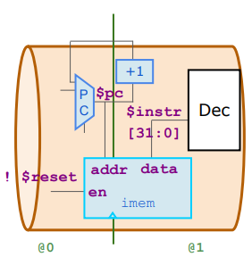

# **RV32 Single-Cycle RISC-V CPU Core**

A single-cycle RISC-V CPU core is a fundamental implementation of the RISC-V instruction set architecture (ISA) designed to execute each instruction in a single clock cycle. This architecture prioritizes simplicity, making it an excellent starting point for understanding processor design.

In a single-cycle processor, all components—including instruction fetch, decode, execute, memory access, and write-back—operate in parallel within one cycle. While this simplifies control logic, it also results in increased critical path delay, limiting clock speed.

This design serves as a foundation for more advanced architectures like pipelined and superscalar processors. 

<br>

## Microarchitecture of RISCV CPU(RV32) :

The microarchitecture of a RISC-V CPU defines the internal structure and data flow required to execute instructions efficiently. It consists of several key components that work together to fetch, decode, execute, and store results. The microarchitecture follows the principles of the RISC-V ISA.


|  |
| :--------------------------------------------------: |
|           RISC-V CPU Micro Architecture     |


<br>

### **Key Components of RISC-V CPU Microarchitecture**  

#### **Program Counter (PC) & Branch Unit**  
   - Maintains the address of the **current instruction**.  
   - Updates based on sequential execution or **branch/jump instructions**.  
   - Works with the ALU to determine branch conditions (BEQ, BNE, JAL).
     
#### **Instruction Fetch Unit (IFU)**  
   - Fetches instructions from memory based on the **Program Counter (PC)**.  
   - Uses an **Instruction Memory** to store and retrieve instructions.  
   - Increments the PC to point to the next instruction.  

#### **Instruction Decode Unit (IDU)**  
   - Decodes the fetched instruction into its operation and operands.  
   - Extracts register addresses, immediate values, and control signals.  
   - Generates necessary control signals for the **ALU, registers, and memory**.  

#### **Register File**  
   - Consists of **32 registers (x0 to x31)**, where x0 is hardwired to zero.  
   - Provides source operands to the ALU and stores results back after execution.  

#### **Arithmetic Logic Unit (ALU)**  
   - Performs arithmetic (ADD, SUB, MUL) and logical (AND, OR, XOR) operations.  
   - Evaluates branch conditions for **conditional jumps**.  
   - Supports shift operations (SLL, SRL, SRA).

<br>

## **RISCV Assembly code :**
On our designed RISCV CPU core in TL-Verilog, we are going to execute below M4 Assembly code

```asm

   //External to function

   m4_asm(ADD, r10, r0, r0)             // Initialize r10 (a0) to 0.

   // Function:

   m4_asm(ADD, r14, r10, r0)            // Initialize sum register a4 with 0x0
   m4_asm(ADDI, r12, r10, 1010)         // Store count of 10 in register a2.
   m4_asm(ADD, r13, r10, r0)            // Initialize intermediate sum register a3 with 0

   // Loop:

   m4_asm(ADD, r14, r13, r14)           // Incremental addition
   m4_asm(ADDI, r13, r13, 1)            // Increment intermediate register by 1
   m4_asm(BLT, r13, r12, 1111111111000) // If a3 is less than a2, branch to label named <loop>
   m4_asm(ADD, r10, r14, r0)            // Store final result to register a0 so that it can be read by main program
   

```

This **M4 assembly code** calculates the sum of numbers from **0 to 9** using a loop. Here’s a **step-by-step breakdown**:

### **External Initialization**
1. `m4_asm(ADD, r10, r0, r0) `  
   - Initializes **register `r10` (a0) to 0**.  
   - This will hold the final result.

### **Function Execution**
2. `m4_asm(ADD, r14, r10, r0)`  
   - Initializes **register `r14` (a4) to 0**, which stores the **sum**.

3. `m4_asm(ADDI, r12, r10, 1010)`  
   - **Stores `10` in `r12` (a2)**, which acts as the **loop limit (count = 10)**.

4. `m4_asm(ADD, r13, r10, r0)`  
   - Initializes **register `r13` (a3) to 0**, which is the **loop counter**.

### **Loop Execution**
5. `m4_asm(ADD, r14, r13, r14)`  
   - **Adds the current loop counter (`r13`) to `r14`**, updating the sum.

6. `m4_asm(ADDI, r13, r13, 1)`  
   - **Increments `r13` by 1** (loop counter increment).

7. `m4_asm(BLT, r13, r12, 1111111111000)`  
   - **Branches back to the loop if `r13` < `r12` (i.e., 10)**.  
   - This ensures **10 iterations** (adding 0+1+2+...+9).

### **Final Result Storage**
8. `m4_asm(ADD, r10, r14, r0)`  
   - **Stores the final sum (`r14 = 45`) in `r10` (a0)**, so the main program can access it.

### **Final Output**
- After execution, `r10 (a0) = 45`, which is the **sum of numbers from 0 to 9**.


This assembly program initializes registers, runs a loop **10 times** to sum numbers **0 to 9**, stores the final sum in `r10`.


## **Starter Code :**
To accesss the strater  code(RISCV Shell), get into the below Github repository and get the starter code in Makerchip IDE.

`https://github.com/stevehoover/RISC-V_MYTH_Workshop`

Access the starter code as shown in below image

|  |
| :--------------------------------------------------: |
|           Starter Code      |

**Starter code contains :**
- A simple RISC-V assembler.
- An instruction memory containing the sum 1..9 test program.
- Commented code for register file and memory.
- Visualization.

Now, we can start designing various components of RV32 RISCV CPU Core...

<br>

## **Program Counter :**


|  |
| :--------------------------------------------------: |
|         Program Counter    |

The Code for Program Counter is as follows
 
```tlv
//Program Counter
$pc[31:0] = (>>1$reset) ? '0 :>>1$pc + 32'h4;
```
- If reset is active → Set pc = 0.
- Otherwise → Increment pc by 4 (move to the next instruction).

<br>

## **Instruction Memory :**

In the started code, uncomment `m4+imem(@1)` for Instruction memory Interface, and alsi uncomment `m4+cpu_viz(@4)` for Visualization.

|  |
| :--------------------------------------------------: |
|           Istruction Mmemory     |

The code for Instruction Memory Interface is as follows

```tlv
 //Instruction Memory
$imem_rd_en = !$reset ? 1 : 0;
$imem_rd_addr[31:0] = $pc[M4_IMEM_INDEX_CNT+1:2];
```

- imem_rd_en → Enabled (1) when reset = 0, disabled (0) on reset.
- imem_rd_addr → Address derived from PC, ensuring word-aligned access.

<br>

## **Instruction Decode Logic :**

|  |
| :--------------------------------------------------: |
|           Decoder     |


Below is the table describing the Type of Instructions based on the opcode

| instr[6:5] \ instr[4:2] | 000  | 001  | 010  | 011  | 100  | 101  | 110  | 111  |
|--------------------------|------|------|------|------|------|------|------|------|
| **00**                  | I    | I    | -    | -    | I    | U    | I    | -    |
| **01**                  | S    | S    | -    | R    | R    | U    | R    | -    |
| **10**                  | R4   | R4   | R4   | R4   | R    | -    | -    | -    |
| **11**                  | B    | I    | -    | J    | *I (unused)* | - | - | - |

The code for Instruction fetch is as follows

```tlv
//Fetch Instruction Data
         $instr[31:0] = $imem_rd_data[31:0];

         //Instruction Type Decode
         $is_i_instr = $instr[6:2] ==? 5'b0000x || $instr[6:2] ==? 5'b001x0 || $instr[6:2] ==? 5'b11001;
         $is_r_instr = $instr[6:2] ==? 5'b01011 || $instr[6:2] ==? 5'b011x0 || $instr[6:2] ==? 5'b10100;
         $is_s_instr = $instr[6:2] == 5'b0100x;
         $is_u_instr = $instr[6:2] == 5'b0x101;
         $is_b_instr = $instr[6:2] == 5'b11000;
         $is_j_instr = $instr[6:2] == 5'b11011;
```


**Fetch Instruction:** $instr = $imem_rd_data (loads instruction from memory).

Identify Instruction Types Based on `Opcode (instr[6:2])`:

| **Instruction Type** | **Opcode (`instr[6:2]`)** |
|----------------------|-------------------------|
| **I-type** (`is_i_instr`) | `0000x`, `001x0`, `11001` |
| **R-type** (`is_r_instr`) | `01011`, `011x0`, `10100` |
| **S-type** (`is_s_instr`) | `0100x` |
| **U-type** (`is_u_instr`) | `0x101` |
| **B-type** (`is_b_instr`) | `11000` |
| **J-type** (`is_j_instr`) | `11011` |

<br>

## **Immediate Instruction Decode Logic :**  

|  |
| :--------------------------------------------------: |
|           Immediate filed in different types of Instructions     |

The code for Immediate Instruction Decode logic is as follows

```tlv
 //Immediate Instruction Decode
         $imm[31:0] = $is_i_instr   ? {{21{$instr[31]}}, $instr[30:20]} :
                      $is_s_instr   ? {{21{$instr[31]}}, $instr[30:25], $instr[11:7]} :
                      $is_b_instr   ? {{20{$instr[31]}}, $instr[7], $instr[30:25], $instr[11:8], 1'b0} :
                      $is_u_instr   ? {$instr[31:12], 12'b0} :
                      $is_j_instr   ? {{12{$instr[31]}}, $instr[19:12], $instr[20], $instr[30:21], 1'b0} :
                      32'b0;
```


- **`$imm[31:0]`** → Extracts and sign-extends immediate values based on instruction type.  
- **Immediate formats:**  
  - **I-type (`is_i_instr`)** → `{21-bit sign-extension, instr[30:20]}`  
  - **S-type (`is_s_instr`)** → `{21-bit sign-extension, instr[30:25], instr[11:7]}`  
  - **B-type (`is_b_instr`)** → `{20-bit sign-extension, instr[7], instr[30:25], instr[11:8], 1'b0}`  
  - **U-type (`is_u_instr`)** → `{instr[31:12], 12'b0}`  
  - **J-type (`is_j_instr`)** → `{12-bit sign-extension, instr[19:12], instr[20], instr[30:21], 1'b0}`  
  - **Default (`else`)** → `32'b0` (Zero for non-immediate instructions).  


<br>

## **Instruction Field Validity Checks :**  

|  |
| :--------------------------------------------------: |
|           RISC-V CPU Micro Architecture     |

Code for Instruction field validity check is as follows

  ```tlv
         //Valid signals for different parts of an Instruction
         $rs1_valid    = $is_r_instr || $is_i_instr || $is_s_instr || $is_b_instr;
         $rs2_valid    = $is_r_instr || $is_s_instr || $is_b_instr;
         $rd_valid     = $is_r_instr || $is_i_instr || $is_u_instr || $is_j_instr;
         $funct3_valid = $is_r_instr || $is_i_instr || $is_s_instr || $is_b_instr;
         $funct7_valid = $is_r_instr;
         $opcode[6:0]    = $instr[6:0];
```
- **`$rs1_valid`** → `rs1` is required for **R, I, S, and B-type** instructions.  
- **`$rs2_valid`** → `rs2` is required for **R, S, and B-type** instructions.  
- **`$rd_valid`** → `rd` is needed for **R, I, U, and J-type** instructions.  
- **`$funct3_valid`** → `funct3` is used in **R, I, S, and B-type** instructions.  
- **`$funct7_valid`** → `funct7` is only relevant for **R-type** instructions.  
- **`$opcode[6:0]`** → Extracts the **7-bit opcode** from the instruction.  

<br>


## **Instruction Component Extraction :**  

Code for instruction Component extraction is as follows

```tlv

//Validity for different components of an Instruction
         ?$rs1_valid
            $rs1[4:0]    = $instr[19:15];
            
         ?$rs2_valid
            $rs2[4:0]    = $instr[24:20];
            
         ?$rd_valid
            $rd[4:0]     = $instr[11:7];
            
         ?$funct3_valid
            $funct3[2:0] = $instr[14:12];
            
         ?$funct7_valid
            $funct7[6:0] = $instr[31:25];


```

- **`$rs1[4:0]`** → Extracts `rs1` from bits **[19:15]** if `$rs1_valid` is true.  
- **`$rs2[4:0]`** → Extracts `rs2` from bits **[24:20]** if `$rs2_valid` is true.  
- **`$rd[4:0]`** → Extracts `rd` from bits **[11:7]** if `$rd_valid` is true.  
- **`$funct3[2:0]`** → Extracts `funct3` from bits **[14:12]** if `$funct3_valid` is true.  
- **`$funct7[6:0]`** → Extracts `funct7` from bits **[31:25]** if `$funct7_valid` is true.  


<br>

## **Instruction Operation Decoding :**  

|  |
| :--------------------------------------------------: |
|           RISC-V CPU Micro Architecture     |

Code for Instruction Operation Decoding is as follows

```tlv

 //dec_bits decided the Instruction operation                          
         $dec_bits[10:0] = {$funct7[5], $funct3, $opcode};

                                       
         //Decoding some Of the RISCV Instructions                        
         $is_beq  = $dec_bits ==? 11'bx_000_1100011;
         $is_bne  = $dec_bits ==? 11'bx_001_1100011;
         $is_blt  = $dec_bits ==? 11'bx_100_1100011;
         $is_bge  = $dec_bits ==? 11'bx_101_1100011;
         $is_bltu = $dec_bits ==? 11'bx_110_1100011;
         $is_bgeu = $dec_bits ==? 11'bx_111_1100011;
         $is_addi = $dec_bits ==? 11'bx_000_0010011;
         $is_add  = $dec_bits ==? 11'b0_000_0110011;

```


#### **Instruction Operation Decoding** 

- **`$dec_bits[10:0]`** → Combines `funct7[5]`, `funct3`, and `opcode` to decide the instruction operation.  

#### **Branch Instructions (Opcode: `1100011`)**  
- **`$is_beq`** → Branch if Equal (`000_1100011`).  
- **`$is_bne`** → Branch if Not Equal (`001_1100011`).  
- **`$is_blt`** → Branch if Less Than (`100_1100011`).  
- **`$is_bge`** → Branch if Greater or Equal (`101_1100011`).  
- **`$is_bltu`** → Branch if Less Than (Unsigned) (`110_1100011`).  
- **`$is_bgeu`** → Branch if Greater or Equal (Unsigned) (`111_1100011`).  

#### **Arithmetic Instructions**  
- **`$is_addi`** → Add Immediate (`000_0010011`).  
- **`$is_add`** → Add (`0_000_0110011`).  

<br>

## **Register File :**

Before defining the code for Register file, uncommment `m4+rf(@1, @1)` for Register File Interface.

|  |
| :--------------------------------------------------: |
|          Register File     |

Code for Regiter file read is as follows

```tlv
 //2-read and 1-write register file 
         //Register file Read
         $rf_rd_en1         = $rs1_valid;
         $rf_rd_index1[4:0] = $rs1[4:0];
         $rf_rd_en2         = $rs2_valid;
         $rf_rd_index2[4:0] = $rs2[4:0];
         $src1_value[31:0] = $rf_rd_data1;
         $src2_value[31:0] = $rf_rd_data2; 
```


- **`rf_rd_en1`** → Enables reading from register `rs1` if valid.  
- **`rf_rd_index1`** → Specifies the index of `rs1` for reading.  
- **`rf_rd_en2`** → Enables reading from register `rs2` if valid.  
- **`rf_rd_index2`** → Specifies the index of `rs2` for reading.  
- **`src1_value`** → Stores the data read from `rs1`.  
- **`src2_value`** → Stores the data read from `rs2`.

<br>

## **Arithmetic Logic Unit :**

|  |
| :--------------------------------------------------: |
|        Arithmetic Logic Unit   |

Code for Arithmetic Logic Unit is as follows

```tlv

//ALU
         $result[31:0] = $is_addi ? $src1_value + $imm :
                         $is_add  ? $src2_value + $src1_value : 32'bx;

```


The ALU (Arithmetic Logic Unit) is responsible for executing arithmetic operations based on the instruction type and operand values.  

#### **Functioning:**  
1. **Result Computation (`$result[31:0]`)**  
   - If the instruction is **Add Immediate (`addi`)** → The result is computed as:  
     ```
     $result = $src1_value + $imm
     ```
   - If the instruction is **Add (`add`)** → The result is computed as:  
     ```
     $result = $src1_value + $src2_value
     ```
   - For other instructions, the result is **undefined (`32'bx`)**.

  <br>

## **Register File Write Operation :**  

|  |
| :--------------------------------------------------: |
|          Register File Write     |


|  |
| :--------------------------------------------------: |
|          Block diagram of Register File    |

Code for Register file Write opertaion is as follows
```tlv
 //Register file write
         $rf_wr_en = ($rd == 5'h0) ? 1'b0 : $rd_valid;
         $rf_wr_index[4:0] = $rd[4:0];
         $rf_wr_data[31:0]  = $result[31:0];

```

The register file write operation ensures that computation results are stored in the appropriate destination register (`rd`).  


1. **Write Enable Signal (`$rf_wr_en`)**  
   - If the destination register (`rd`) is **zero (`x0`)**, writing is **disabled** (`1'b0`), as register `x0` in RISC-V is **hardwired to zero**.  
   - Otherwise, writing is enabled if the instruction is **valid for `rd`** (`$rd_valid`).  

2. **Write Index (`$rf_wr_index[4:0]`)**  
   - Specifies the destination register (`rd`) where the result will be written.  
   - Extracts the 5-bit register address from `$rd[4:0]`.  

3. **Write Data (`$rf_wr_data[31:0]`)**  
   - The computed result (`$result[31:0]`) is written into the register file at the specified **destination register (`rd`)**.  

<br>

## **Branch Instruction Evaluation :**  

Code for Barnch Instruction Evaluation is as follows

```tlv

   //Checking for Branch Instruction
         $taken_br = $is_beq  ? ($src1_value == $src2_value) :
                     $is_bne  ? ($src1_value != $src2_value) :
                     $is_blt  ? ($src1_value < $src2_value) ^ ($src1_value[31] != $src2_value[31]) :
                     $is_bge  ? ($src1_value > $src2_value) ^ ($src1_value[31] != $src2_value[31]) :
                     $is_bltu ? ($src1_value <= $src2_value) :
                     $is_bgeu ? ($src1_value >= $src2_value) :
                     1'b0;
```


This logic determines whether a branch should be taken based on different RISC-V branch instructions.  

  

1. **Branch Decision (`$taken_br`)**  
   - Evaluates different branch conditions based on the instruction type.  
   - The result is **1 (`true`)** if the branch condition is met, otherwise **0 (`false`)**.  

2. **Branch Conditions:**  
   - **BEQ (`$is_beq`)** → Branch if `src1_value == src2_value`.  
   - **BNE (`$is_bne`)** → Branch if `src1_value != src2_value`.  
   - **BLT (`$is_blt`)** → Branch if `src1_value < src2_value`, handling signed values.  
   - **BGE (`$is_bge`)** → Branch if `src1_value >= src2_value`, handling signed values.  
   - **BLTU (`$is_bltu`)** → Branch if `src1_value < src2_value` (unsigned).  
   - **BGEU (`$is_bgeu`)** → Branch if `src1_value >= src2_value` (unsigned).  

3. **Signed vs. Unsigned Handling:**  
   - **Signed comparisons (`BLT`, `BGE`)** use **XOR** to handle sign-bit differences.  
   - **Unsigned comparisons (`BLTU`, `BGEU`)** are directly checked.  

<br>

## **Branch Target Address Calculation :**  

|  |
| :--------------------------------------------------: |
|           Branch support     |

Code for Branch target Address Calculation is as follows

```tlv

 //Update of Branch Branch Instruction Address
         $br_tgt_pc[31:0] = $pc + $imm;

```

This logic updates the **branch target address** when a branch instruction is executed.  

#### **Functioning:**  

1. **Branch Target Address (`$br_tgt_pc`)**  
   - Computes the **next instruction address** when a branch is taken.  
     - **`pc`** → Current Program Counter (PC).  
     - **`imm`** → Immediate offset value (signed).  

2. **Purpose:**  
   - If a branch instruction evaluates **true**, execution jumps to `$br_tgt_pc`.  
   - Used in **loops, conditional jumps, and branching operations**.  

<br>

## **Program Counter (PC) Update with Branch Support :**  

Code for Porgram Counter with update of branch support is as follows

```tlv

 $pc[31:0] = (>>1$reset) ? '0 : >>1$taken_br ? >>1$br_tgt_pc : >>1$pc + 32'h4;

```

This logic updates the **Program Counter (PC)** to handle both **sequential execution** and **branch instructions**.  

#### **Functioning:**  

1. **Reset Condition (`>>1$reset`)**  
   - If **reset** is active, set **PC = 0** to start execution from the beginning.  
   
2. **Branch Handling (`>>1$taken_br ? >>1$br_tgt_pc`)**  
   - If a **branch condition is met** (`taken_br = 1`), update **PC** to the **branch target address (`br_tgt_pc`)**.  
   - Ensures correct jumps during **conditional branching** (e.g., BEQ, BNE, BLT).  

3. **Normal Execution (`>>1$pc + 32'h4`)**  
   - If no branch is taken, increment PC by **4** (next instruction).  
   - Standard **instruction fetch** for **32-bit instructions** in RISC-V.  

<br>

## **Testbench for Simulation Verification :**  

Code for Testbench to check whether the CPU is working properly or not is as follows
```tlv
//Testbench(Simulation passed when Value stored in register 10 equals to Sum of numbers from 1 to 9 as per our ASM code     
         *passed = |cpu/xreg[10]>>5$value == (1+2+3+4+5+6+7+8+9);
         *failed = 1'b0;

````

This testbench logic verifies whether the CPU correctly calculates the **sum of numbers from 1 to 9** and stores the result in **register x10**.  


1. **Checking Test Passed Condition (`*passed`)**  
   - Reads the value from **register x10** (`cpu/xreg[10]`).  
   - Compares it with the expected sum **(1+2+3+4+5+6+7+8+9 = 45)**.  
   - If the stored value **matches 45**, the test **passes** (`*passed = 1`).  

2. **Setting Test Failed Condition (`*failed`)**  
   - Default value is set to **0** (`*failed = 1'b0`).  
   - If the condition in `*passed` is **not met**, it implies failure.  

You can now view the `log` as follows which tells that our CPU is working fine..

|  |
| :--------------------------------------------------: |
|           RISC-V CPU Micro Architecture     |


<br>

## **Suppressing Warnings for Unused Variables :**  

Code for suppression of Unused variable warning is as follows

```tlv

//For removal of Warnings in the log as Unassigned variables
`BOGUS_USE($is_beq $is_bne $is_blt $is_bge $is_bltu $is_bgeu)

```

This directive is used to **avoid warnings** in the simulation logs about unassigned or unused variables.  

 
1. **`BOGUS_USE` Macro**  
   - This is a common macro used in some simulation environments to **trick the compiler** into thinking a variable is being used.  
   - Prevents **"unassigned variable"** or **"unused signal"** warnings.  

2. **Avoiding Warnings for Branch Signals**  
   - The macro ensures that the following branch instruction signals are **not reported as unused:**  
     - `$is_beq` (Branch if Equal)  
     - `$is_bne` (Branch if Not Equal)  
     - `$is_blt` (Branch if Less Than)  
     - `$is_bge` (Branch if Greater or Equal)  
     - `$is_bltu` (Branch if Less Than Unsigned)  
     - `$is_bgeu` (Branch if Greater or Equal Unsigned)  


## **Single Cycle RISC-V CPU Core Resources :**  

| **Description** | **Link** |
|---------------|---------|
| **Complete Code for Single Cycle RISC-V CPU Core** | [Click here](./../RISCV_CPU_Core/Single_Cycle_RISCV_CPU/Single_cycle_RISCV_CPU_Core.tlv) |
| **Output Diagram from Makerchip IDE** | [Click here](./../RISCV_CPU_Core/Single_Cycle_RISCV_CPU/Single_cycle_riscv_cpu_core.png) |
| **Visualization of RISC-V CPU Functioning** | [Click here](./../RISCV_CPU_Core/Single_Cycle_RISCV_CPU/Single_cycle_riscv_cpu_core_viz.png) |
| **Open Makerchip IDE for this CPU Core** | [Click here](./../RISCV_CPU_Core/Single_Cycle_RISCV_CPU/Single_cycle_riscv_cpu_core_viz.png) |

