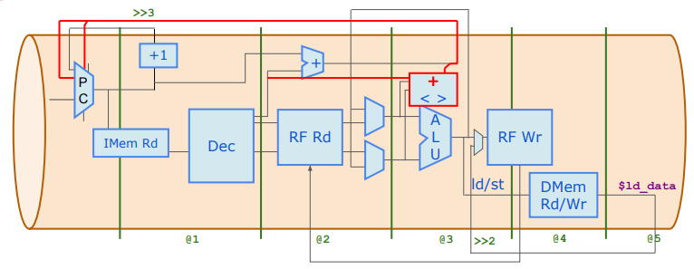
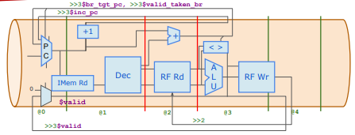
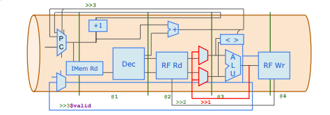

# **Pipelined RISC-V CPU Core**  
This project implements a **5-stage pipelined RISC-V CPU core** using **TL-Verilog** in **Makerchip IDE**.  
It is an optimized version of the **single-cycle CPU** by introducing **instruction pipelining** for higher efficiency and better performance.  


|  |
| :--------------------------------------------------: |
|         Architecture of Pipelined RISCV CPU Core   |

## **Why Pipelining?**
### **Limitations of Single-Cycle CPU:**
- **Every instruction completes in one cycle** → Requires a long cycle time.  
- **No instruction overlap** → One instruction at a time → Wasted resources.  
- **Limited clock speed** → Slows overall execution.  

### **Advantages of Pipelining:**
- **Instruction overlap** → Increases instruction throughput.  
- **Shorter cycle time** → Faster execution per instruction.  
- **Higher efficiency** → Utilizes CPU resources optimally.  
- **One instruction completes every cycle** (after filling the pipeline).  

---

## **🚀 Single-Cycle vs. Pipelined RISC-V CPU Core :**
  

| **Aspect**          | **Single-Cycle CPU** | **Pipelined CPU** |
|---------------------|---------------------|-------------------|
| **Execution Model** | Completes **one instruction per cycle** | **Overlaps execution** of multiple instructions |
| **Clock Cycle Per Instruction (CPI)** | CPI **≥ 1** (depends on instruction complexity) | Ideal CPI **≈ 1** (one instruction finishes per cycle) |
| **Instruction Latency** | **One cycle** for each stage | **Five cycles per instruction**, but pipeline allows overlap |
| **Performance** | **Slow** (must complete entire instruction in one cycle) | **Fast** (multiple instructions processed at once) |
| **Hardware Utilization** | **Inefficient** (ALU and memory sit idle for most of the time) | **Efficient** (Each pipeline stage works every cycle) |
| **Hazard Handling** | Not required | Requires **Data Forwarding, Stalls, Branch Prediction** |

<br>


## **Pipeline Stages & Execution**
A **5-stage pipeline** is used in this RISC-V CPU implementation:  

| **Pipeline Stage** | **Function** | **Key Blocks** |
|--------------------|-------------|----------------|
| **IF (Instruction Fetch)** | Fetches instruction from memory | `$pc`, `$imem_rd_en`, `$imem_rd_addr`, `$inc_pc` |
| **ID (Instruction Decode)** | Decodes opcode, registers, immediate values | `$instr`, `$is_*_instr`, `$imm`, `$rs1_valid`, `$rs2_valid`, `$rd_valid`, `$funct3_valid`, `$funct7_valid`, `$opcode` |
| **EX (Execute)** | Performs ALU operations | `$src1_value`, `$src2_value`, `$result`, `$sltu_result`, `$sltiu_result` |
| **MEM (Memory Access)** | Reads/Writes from data memory | `$dmem_rd_en`, `$dmem_wr_en`, `$dmem_addr`, `$dmem_wr_data` |
| **WB (Write Back)** | Stores ALU or memory result in the register file | `$rf_wr_en`, `$rf_wr_index`, `$rf_wr_data` |

---

## **How Instructions Flow in a Pipeline**  
Let’s assume we execute these **5 instructions**:  

```asm
ADD x3, x1, x2  
SUB x4, x3, x2  
LW  x5, 0(x3)  
SW  x5, 0(x4)  
BEQ x1, x2, LABEL
```
Each instruction moves through the pipeline like this:

| **Cycle** | **IF**  | **ID**  | **EX**  | **MEM** | **WB**  |
|-----------|--------|--------|--------|--------|--------|
| 1         | ADD    |        |        |        |        |
| 2         | SUB    | ADD    |        |        |        |
| 3         | LW     | SUB    | ADD    |        |        |
| 4         | SW     | LW     | SUB    | ADD    |        |
| 5         | BEQ    | SW     | LW     | SUB    | ADD    |
| 6         | ...    | BEQ    | SW     | LW     | SUB    |


## **Pipeline Hazards in Pipelined RISC-V CPU**

| **Hazard Type**        | **Cause** | **Effect** | **Solution** |
|------------------------|----------|------------|--------------|
| **Data Hazard**        | One instruction depends on the result of a previous instruction | Incorrect execution order | Forwarding (Bypassing), Pipeline Stall |
| **Read-After-Write (RAW)** | Instruction reads a register before the previous instruction writes to it | Uses incorrect/old data | Forwarding, Stall if needed |
| **Write-After-Read (WAR)** | Instruction writes to a register before the previous instruction reads it | Incorrect register value | Register Renaming (Used in OoO CPUs) |
| **Write-After-Write (WAW)** | Two instructions write to the same register in the wrong order | Incorrect register update | Register Renaming, Instruction Reordering |
| **Control Hazard (Branch Hazard)** | Branch or jump instruction changes the flow | Pipeline executes the wrong instruction | Branch Prediction, Stall, Flush |
| **Structural Hazard** | Two instructions compete for the same hardware resource (e.g., memory or ALU) | Cannot execute both in the same cycle | Separate Memory (Harvard Architecture), Caching |


## **Pipelined CPU Implementation**

For the implementation of Pipelined RISCV CPU Core, let's see what changes we have to make to [Single Cycle RISCV Core](./../RISCV_CPU_Core/Single_Cycle_RISCV_CPU/Single_cycle_RISCV_CPU_Core.tlv).

Based on the RISC-V architecture, modify the pipeline design by changing the macro `m4+rf(@1, @1)` to `m4+rf(@2, @3)`.

## **3-Cycle Validity**
The `$valid` signal is used to propagate instruction validity through the pipeline.


|  |
| :--------------------------------------------------: |
|         3-cycle Validity   |


```tlv
$valid = !(>>1$valid_taken_br || >>2$valid_taken_br || >>1$valid_load || >>2$valid_load || >>1$valid_jump || >>2$valid_jump);
```


Here, `$valid` is active (1) unless one of the following invalidates the instruction:
**Branch Taken (`valid_taken_br`)**  
- If a branch is taken in the previous (`>>1`) or two cycles before (`>>2`), the instruction is no longer valid.
**Load Hazard (`valid_load`)**  
- If a load instruction is still being processed in the last two cycles, the pipeline must stall.
**Jump Instruction (`valid_jump`)**  
- If a jump occurs in the last two cycles, the pipeline must flush incorrect instructions.


Let's see the dependency factors of `$valid` as shown below

| **3-Cycle Validity** | **Purpose** |
|---------------|------------|
| `$valid = !(>>1$valid_taken_br || >>2$valid_taken_br || >>1$valid_load || >>2$valid_load || >>1$valid_jump || >>2$valid_jump);` | Ensures instruction validity for 3 cycles, preventing premature execution. |
| `$valid_taken_br = $valid && $taken_br;` | Ensures branch instructions remain valid and prevents execution until the branch condition is resolved. |
| `$valid_load = $valid && $is_load;` | Prevents load-use hazards by ensuring load instructions remain valid for 3 cycles. |
| `$valid_jump = $valid && $is_jump;` | Ensures jump instructions remain valid, preventing incorrect PC updates. |
| `$pc[31:0] = (>>1$reset) ? '0 : (>>3$taken_br) ? >>3$br_tgt_pc : (>>3$valid_load) ? >>3$inc_pc : (>>3$valid_jump && >>3$is_jal) ? >>3$br_tgt_pc : (>>3$valid_jump && >>3$is_jalr) ? >>3$jalr_tgt_pc : >>1$inc_pc;` | Updates **PC correctly after 3 cycles**, preventing incorrect instruction fetching. |

---


## **Register File Bypass**
Bypassing prevents stalls by forwarding the latest computed values directly to dependent instructions.


|  |
| :--------------------------------------------------: |
|      Register File Bypass  |

```tlv
$src1_value[31:0] = ((>>1$rd == $rs1) && >>1$rf_wr_en) ? >>1$result : $rf_rd_data1[31:0];
$src2_value[31:0] = ((>>1$rd == $rs2) && >>1$rf_wr_en) ? >>1$result : $rf_rd_data2[31:0];
```

- Compares `$rd` of previous instruction (`>>1$rd`) with `$rs1` or `$rs2` of the current instruction.
- If a match is found **and** the previous instruction writes to a register (`$rf_wr_en`), it uses the forwarded value (`>>1$result`).
- Otherwise, it **reads from the register file**.


## **Complete Instruction Decode**
### **Extracting Fields**

|  |
| :--------------------------------------------------: |
|   Complete Instructions Decode based on opcode, funct3 & funct7 |

```tlv

 //Decoding some of the RISCV Instructions     
         $is_beq = $dec_bits ==? 11'bx_000_1100011;
         $is_bne = $dec_bits ==? 11'bx_001_1100011;
         $is_blt = $dec_bits ==? 11'bx_100_1100011;
         $is_bge = $dec_bits ==? 11'bx_101_1100011;
         $is_bltu = $dec_bits ==? 11'bx_110_1100011;
         $is_bgeu = $dec_bits ==? 11'bx_111_1100011;
         
         // Arithmetic Instruction
         $is_add = $dec_bits ==? 11'b0_000_0110011;
         $is_addi = $dec_bits ==? 11'bx_000_0010011;
         $is_or = $dec_bits ==? 11'b0_110_0110011;
         $is_ori = $dec_bits ==? 11'bx_110_0010011;
         $is_xor = $dec_bits ==? 11'b0_100_0110011;
         $is_xori = $dec_bits ==? 11'bx_100_0010011;
         $is_and = $dec_bits ==? 11'b0_111_0110011;
         $is_andi = $dec_bits ==? 11'bx_111_0010011;
         $is_sub = $dec_bits ==? 11'b1_000_0110011;
         $is_slti = $dec_bits ==? 11'bx_010_0010011;
         $is_sltiu = $dec_bits ==? 11'bx_011_0010011;
         $is_slli = $dec_bits ==? 11'b0_001_0010011;
         $is_srli = $dec_bits ==? 11'b0_101_0010011;
         $is_srai = $dec_bits ==? 11'b1_101_0010011;
         $is_sll = $dec_bits ==? 11'b0_001_0110011;
         $is_slt = $dec_bits ==? 11'b0_010_0110011;
         $is_sltu = $dec_bits ==? 11'b0_011_0110011;
         $is_srl = $dec_bits ==? 11'b0_101_0110011;
         $is_sra = $dec_bits ==? 11'b1_101_0110011;

         // Load Instruction
         $is_load = $dec_bits ==? 11'bx_xxx_0000011;
         
         // Store Instruction
         $is_sb = $dec_bits ==? 11'bx_000_0100011;
         $is_sh = $dec_bits ==? 11'bx_001_0100011;
         $is_sw = $dec_bits ==? 11'bx_010_0100011;
         
         // Jump Instruction
         $is_lui = $dec_bits ==? 11'bx_xxx_0110111;
         $is_auipc = $dec_bits ==? 11'bx_xxx_0010111;
         $is_jal = $dec_bits ==? 11'bx_xxx_1101111;
         $is_jalr = $dec_bits ==? 11'bx_000_1100111;
         
         $is_jump = $is_jal || $is_jalr;

```

| **Instruction Type**  | **Definition** |
|----------------------|---------------|
| **Branch Instructions** | Control flow instructions that change the execution path based on a condition. They compare two registers and update the program counter (PC) if the condition is met. |
| **Arithmetic (R-Type) Instructions** | Perform mathematical and logical operations between two registers and store the result in a destination register. These include addition, subtraction, bitwise operations, and shifts. |
| **Arithmetic (I-Type) Instructions** | Perform operations similar to R-type but with an immediate (constant) value instead of a second register. These include add immediate, bitwise operations, and shifts. |
| **Load Instructions** | Fetch data from memory and store it in a register. Used to retrieve values needed for computations. |
| **Store Instructions** | Write data from a register into memory. Used to save results or transfer data between registers and memory. |
| **Jump Instructions** | Unconditional branch instructions that modify the program counter (PC) directly, either with an immediate address or a register-based address. Used for function calls and loops. |


## **ALU Execution**


|  |
| :--------------------------------------------------: |
|   Arihtmetic Logic Unit |

```tlv
 // Arithmetic Logic Unit
         $sltu_result = $src1_value < $src2_value ;
         $sltiu_result = $src1_value < $imm ;
         $result[31:0] = $is_addi ? $src1_value + $imm :
                         $is_add ? $src1_value + $src2_value : 
                         $is_or ? $src1_value | $src2_value : 
                         $is_ori ? $src1_value | $imm :
                         $is_xor ? $src1_value ^ $src2_value :
                         $is_xori ? $src1_value ^ $imm :
                         $is_and ? $src1_value & $src2_value :
                         $is_andi ? $src1_value & $imm :
                         $is_sub ? $src1_value - $src2_value :
                         $is_slti ? (($src1_value[31] == $imm[31]) ? $sltiu_result : {31'b0,$src1_value[31]}) :
                         $is_sltiu ? $sltiu_result :
                         $is_slli ? $src1_value << $imm[5:0] :
                         $is_srli ? $src1_value >> $imm[5:0] :
                         $is_srai ? ({{32{$src1_value[31]}}, $src1_value} >> $imm[4:0]) :
                         $is_sll ? $src1_value << $src2_value[4:0] :
                         $is_slt ? (($src1_value[31] == $src2_value[31]) ? $sltu_result : {31'b0,$src1_value[31]}) :
                         $is_sltu ? $sltu_result :
                         $is_srl ? $src1_value >> $src2_value[5:0] :
                         $is_sra ? ({{32{$src1_value[31]}}, $src1_value} >> $src2_value[4:0]) :
                         $is_lui ? ({$imm[31:12], 12'b0}) :
                         $is_auipc ? $pc + $imm :
                         $is_jal ? $pc + 4 :
                         $is_jalr ? $pc + 4 : 
                         ($is_load || $is_s_instr) ? $src1_value + $imm : 32'bx;
```

 ### **Operations peformed by the ALU :**

**Comparison Operations:**  
- **SLTU:** Sets `1` if `rs1 < rs2` (unsigned).  
- **SLTIU:** Sets `1` if `rs1 < imm` (unsigned).  
  Used for Conditional execution, loops, decision-making.  

**Arithmetic Operations:**  
- **ADD/ADDI:** Adds registers or immediate values.  
- **SUB:** Subtracts `rs2` from `rs1`.  
  Used for Counters, memory address calculations.  

**Bitwise Operations:**  
- **OR/ORI:** Bitwise OR between registers or immediate.  
- **XOR/XORI:** Toggles bits.  
- **AND/ANDI:** Used for bit masking.  
Used for Boolean logic, condition flags, bit manipulations.  

**Shift Operations:**  
- **SLLI:** Left shift (multiplication by `2^n`).  
- **SRLI:** Logical right shift (division by `2^n`).  
- **SRAI:** Arithmetic right shift (preserves sign).  
Used for Multiplication, division, data alignment.  

**Control Operations (LUI, AUIPC, Jumps):**  
- **LUI:** Loads an immediate to the upper 20 bits of a register.  
- **AUIPC:** Adds an immediate to PC.  
- **JAL/JALR:** Computes jump addresses.  
Used for Memory addressing, function calls, PC control.  


## **Load/Store Instructions**


|  |
| :--------------------------------------------------: |
|  Load/Store Instructions |

Code for Load/Store Instructions is as follows
```tlv
$dmem_rd_en = $valid_load;
$dmem_wr_en = $valid && $is_s_instr;
$dmem_addr[3:0] = $result[5:2];
$dmem_wr_data[31:0] = $src2_value[31:0];
$ld_data[31:0] = $dmem_rd_data[31:0];
```
- **Load (LW)** → Reads memory and writes into registers.
- **Store (SW)** → Writes register values into memory.


### **Load Hazard Handling**
```tlv
$valid_load = $valid && $is_load;
```
Ensures that loads do not interfere with dependent instructions.

---

## **Jump Instructions**

|  |
| :--------------------------------------------------: |
|  Jump Instructions |

Code for JumpInstructions is as follows:
```tlv
$is_jump = $is_jal || $is_jalr;
$jalr_tgt_pc[31:0] = $src1_value + $imm;
$valid_jump = $valid && $is_jump;
```
- **JAL:** `PC = PC + immediate`
- **JALR:** `PC = rs1 + immediate`

### **Jump Hazard Handling**
- `$valid_jump` ensures only **valid** jumps execute.
- The program counter (`PC`) is updated afterthe jump condition is checked.


With this, we have designed our pipelined RISCV CPU Core.


## **Pipelined RISC-V CPU Core Resources :**  

| **Description** | **Link** |
|---------------|---------|
| **Complete Code for Pipelined RISC-V CPU Core** | [Click here](./../RISCV_CPU_Core/Pipelined_RISCV_CPU_Core/Pipelined_RISCV_CPU_Core.tlv) |
| **Output Diagram from Makerchip IDE** | [Click here](./../RISCV_CPU_Core/Pipelined_RISCV_CPU_Core/pipelined_riscv_cpu_core.png) |
| **Visualization of RISC-V CPU Functioning** | [Click here](./../RISCV_CPU_Core/Pipelined_RISCV_CPU_Core/pipelined_riscv_cpu_core_viz.png) |
| **Open Makerchip IDE for this CPU Core** | [Click here](https://makerchip.com/sandbox/0J6f8hLwM/0X6hXqD) |


